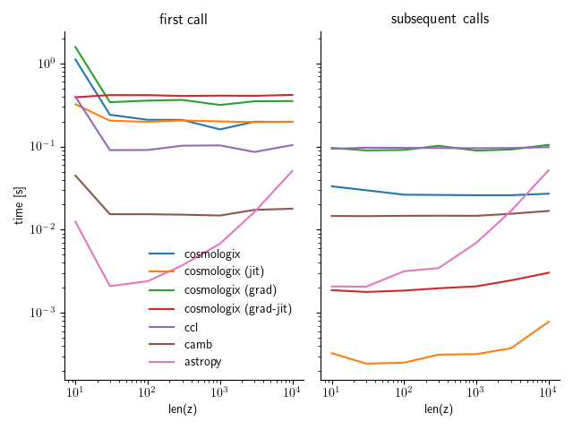

# Summary

Type-Ia supernovae are used to measure luminosity distances in the
universe thanks to their property of standard -- or standardizable --
candle. Cosmologix makes inference of cosmological parameters from
thousands of such measurements easier and faster by providing fully
differentiable computation of the distance-redshift relation as
function of the cosmological parameters. It also provide common
fitting formulae for the acoustic scale so that the resulting code can
be used for fast cosmological inference from supernovae in combination
with BAO or CMB distance measurements. We checked the accuracy of our
computation against CCL and astropy.cosmology and show that our
implementation can outperform both codes by 1 order of magnitudes in
speed while maintaining a reasonable accuracy of $10^{-4}$ mag on
distance modulii in the redshift range $0.01 < z < 1000$.

# Statement of need

Several software are available to compute cosmological distances
including `astropy`, `camb`, `class`, `ccl`. To our knowledge only
`jax-cosmo` and `cosmoprimo` may provide automatic differentiation
through the use of JAX. Unfortunately, at the time of writing, the
computation in cosmoprimo does not seem to be jitable and distance
computation in jax-cosmo is neglecting contributions to the energy
density from neutrinos species. The accuracy of the resulting
computation is insufficient for the need of the LEMAITRE analysis.

The LEMAITRE collaboration is therefore releasing its internal code
for the computation of cosmological distances. The computation itself
is very standard, but the implementation in JAX is taylored for speed,
while preserving reasonable accuracy.

# Computations of the homogeneous background evolution

## Friedmann equations

All computations in cosmologix are made for the
Friedman-Lemaitre-Robertson-Walker metric (isotropic and homogeneous
universe).
\begin{equation}
  \label{eq:27}
  ds^2 = -c^2dt^2 + R^2(t) \left(\frac{dr^2}{1-kr^2} + r^2(d\theta^2 +
    sin^2\theta d\phi^2) \right) \quad \text{with} \quad k = \lbrace-1, 0, 1\rbrace.
\end{equation}
Denoting $a = \frac{R}{R_0}$ and:
$$
S=\left\lbrace
    \begin{array}{l}
      \sinh \text{ if k = 1}\\
      \mathrm{Id} \text{ if k = 0}\\
      \sin \text{ if k = -1}\\
    \end{array}
  \right.,
$$
and $r = S\left(\frac{\chi}{R_0}\right)$, the metrics rewrites:
\begin{equation}
    ds^2 = -c^2 dt^2 +  a^2(t)\left( d\chi^2 + R_0^2 S^2\left(\frac{\chi}{R_0}\right) d\Omega^2\right)
\end{equation}

The first Friedman equation without the cosmological
constant term (whose role will be held by the fluid) reads:

\begin{equation}
  \label{eq:2}
  H^2 = \frac{8\pi G}{3}\rho - \frac{k}{R^2}\,,
\end{equation}

where $\rho$ is the proper energy density, $R$ the scale factor, $H =
\dot R / R$ the Hubble parameter and $k = {-1, 0, 1}$ is the sign of
spatial curvature. The value of constants (such as $G$) used in the
code are given in Table

Denoting, as usual, $\rho_{c} = \frac{3 H_0^2}{8\pi G}$ the
critical value of the density for which the universe today is flat,
$\Omega_0 = \frac{\rho_0}{\rho_{c}}$ the reduced energy density
today and $\Omega_k = -\frac{k}{R^2_0H^2_0}$, one can rewrite equation
under its most common form: \begin{equation} \label{eq:3}
\frac{H^2}{H_0^2} = \Omega_0 \frac{\rho}{\rho_0} + \Omega_k (1+z)^2
\end{equation}


## Densities

We follow the common practice to split the universe energy content
into several components such as cold (pressureless) matter, radiation
or dark energy. Most of the components are parameterized in the code
by there reduced density today and the parameter of their equation of
state, but for photons, for which we pass the observed temperature of
the CMB $T_{cmb}$ instead, and for neutrinos which, in the general
case, transition from ultra-relativistic to non-relativistic over the
period of interest and whose energy density evolution requires a
specific numerical computation.

### Species parameterized by reduced density and Equations of state

For a perfect fluid $X$ with equation of state $\rho_X = w_x p_x$, the
energy conservation writes:

\begin{equation}
  \label{eq:4}
  \frac{d}{dt}(\rho_x R^3) = -3 p_x R^2 \dot R = -3 w_x \rho_x R^2 \dot R\,,
\end{equation}
which can be integrated to give:

\begin{equation}
  \label{eq:5}
  \log \frac{\rho_x}{\rho_x^0} = 3 \int_0^z \frac{1+w_x(z)}{1+z}dz
\end{equation}

In the code the following components follow this description, with
simplification made when appropriate:

- Baryonic matter: $\Omega_b, w_b=0$  which gives $\frac{\rho_b}{\rho_b^0} = (1+z)^3$,
- Cold dark matter: $\Omega_c, w_c=0$ which gives $\frac{\rho_b}{\rho_b^0} = (1+z)^3$,
- and dark energy $\Omega_x$.
We allow dark energy to have a variable equation of state according to the common (CPL, \cite{}) parametrization: $w(z) = w + \frac{z}{1+z} w_a$ with $w$ and $w_a$ as free parameters. Once integrated this gives the following evolution for the contribution to density:

$$\rho_x/\rho_0 = \exp\left(3 (1 + w + w_a) \log(1+z) - 3 w_a \frac{z}{1+z}\right).$$
  
  
### Relic photons

In the more general case, the energy density of specie $i$ is obtained
by integration over the distribution function: \begin{equation}
\label{eq:12} \rho_i c^2= g_i \int N_i(p) E(p) \frac{4\pi p^2dp}{h^3}
\end{equation} where $g_i$ is the degeneracy number of the species.

For photons with two spin states this reduces to Stephan's law, given that:
\begin{equation}
  \label{eq:14}
  N_\gamma(p) = \frac{1}{e^{\frac{cp}{k_B T_\gamma}} + 1}, \quad g_i=2,
\end{equation}
which gives, with the variable change $x=\frac{cp}{k_BT_\gamma}$:
\begin{align}
  \label{eq:15}
  \rho_\gamma c^2 &= \frac{8\pi(k_B T_\gamma)^4}{ c^3 h^3}  \int_0^\infty \frac{x^3}{e^x - 1} dx\\
  &=\frac{8\pi^5(k_B T_\gamma)^4}{15 c^3 h^3} 
\end{align}
where we have used the result $\int_0^\infty u^{s-1}/(e^u - 1) du =
\Gamma(s) \zeta(s)$. 

Instead of providing $\Omega_\gamma^0$ the code expects the
temperature of the frozen thermal spectrum today denoted $T^0_\gamma =
T_{cmb}$ from which it computes $\Omega_\gamma(T_\text{cmb}, H_0) =
\rho_\gamma(T_{cmb}) / \rho_c(H_0)$. The density then evolves as
$T_\gamma^4 \propto (1+z)^4$.  As a default value the code uses
$T_\gamma^0 = 2.7255 K$ \cite{2009ApJ...707..916F}.

### Neutrinos

For neutrinos following the Fermi-Dirac distribution, neglecting
the chemical potential at high temperature, we have:
\begin{equation}
  \label{eq:11}
  N_i(p) = \frac{1}{e^{\frac{E}{k_B T_i}} + 1}
\end{equation}
with $E(p)^2 = c^2p^2 + m^2c^4$. While relativistic, with the same
variable change as above:
\begin{align}
  \label{eq:13}
  \rho^\text{nomass}_i c^2&= g_i \frac{4\pi(k_B T_i)^4}{ c^3 h^3}  \int_0^\infty \frac{x^3}{e^x + 1} dx\\
  &=\frac{g_i 4\pi^5(k_B T_i)^4}{15 c^3 h^3}\frac{7}{8}
\end{align}
where we have used $\int_0^\infty u^{s-1}/(e^u + 1) du = \Gamma(s)
\zeta(s) (1-1/2^{s-1})$. The universe is heated by the
electron-positron annihilation when the decoupling of neutrinos is
nearly complete. The neutrinos and photon temperature after
annihilation are related by:
\begin{equation}
  \label{eq:16}
  \frac{T_\nu}{T_\gamma} = \left( \frac{4}{11}\right)^{1/3} \left(\frac{N_\text{eff}}3\right)^{1/4}
\end{equation}
with a default value for $N_\text{eff} = 3.046$ \cite{2005NuPhB.729..221M}. The
effective density for 6 species of relativistic neutrinos and
anti-neutrinos is:
\begin{equation}
  \label{eq:18}
  \rho_\nu = \frac78 N_\text{eff}\left(\frac{4}{11}\right)^{4/3}\rho_\gamma\,.
\end{equation}

The distribution of neutrinos after decoupling is frozen. The energy
density for massive neutrinos, assuming that the decoupling occurs
when neutrinos are still ultra-relativistic, is given by:
\begin{align}
  \label{eq:17}
  \rho_i & = g_i \frac{4\pi(k_B T_i)^4}{ c^3 h^3}  \int_0^\infty \frac{x^3\sqrt{1 + (\bar m/x)^2}}{e^x + 1} dx\\
  & = \rho^\text{nomass}_i \frac{120}{7\pi^4} I(\bar m)\,,
\end{align}
where we denote $\bar m = m_i c^2 / (k_B T_i)$. Fast evalution of this integral is obtained as follows:

\begin{itemize}
\item ultra-relativistic case ($\bar m \leq 0.01$): the integral is evaluated analytically through the expansion $I(\bar m) \sim I(0) (1 + \frac5{7\pi^2} \bar m^2)$.
\item intermediate case $0.01 < \bar m < 1000$: $I(\bar m)$ is evaluated
  numerically at 35 Chebyshev nodes in $\log10(\bar m)$. The $k^{th}$ of $ n=35$ Chebyshev nodes are defined on the segment $[-1, 1]$ as $\cos(k \pi / n)$, and mapped to the segment $[-2, 3]$ in the log space. The function is then evaluated as $I(\bar m) = N(\bar m)$ where $N$ is the Newton interpolation polynomial accross the 35 precomputed nodes. The numerical pre-computation of the integral at the 35 nodes uses the trapezoidal rule over $10^4$ points in $x$ with infrared and ultraviolet cutoff at $x=10^{-3}$ and $x=31$.
\item non-relativistic case ($\bar m \geq 1000$): the integral is again evaluated analytically through the expansion $I(\bar m) \sim \frac32 \zeta(3) \bar m + \frac{3}{4\bar m} 15 \zeta(5)$ .
\end{itemize}

The relative difference between the numerical computation and the fast and composite interpolation-expansion is shown in Fig. \autoref{fig:densityinterpolation}. The approximation is shown to have a worst case accuracy better than $10^{7}$ which is largely sufficient for the subdominant specy.


The parametrisation of neutrinos density follows the common current practice to provide the value of the effective number $N_\text{eff}$ and the sum of neutrinos masses in $m_\nu$ ($0.06$ eV by default). For the computation, the entire mass is affected to one massive specie and the two others are kept massless. The code itself preforms the actual computation for the three species so that this convention can be easily changed.

### Parameterization summary
To summarize, the energy content and age of the Universe is parameterized in the code using the following minimal set of parameters, given along their default value as a python dictionnary:

```python
{'Tcmb': 2.7255, # CMB temperature today in K
 'Omega_bc': 0.31315017687047186, # \Omega_b + \Omega_c
 'H0': 67.37, # Hubble constant in km/s/Mpc
 'Omega_b_h2': 0.02233, # \Omega_b * (H0/100)^2
 'Omega_k': 0.0, # \Omega_k
 'w': -1.0,
 'wa': 0.0,
 'm_nu': 0.06, # Sum of neutrinos masses in eV
 'Neff': 3.046 # Effective number of neutrino species
 }
```

## Distances

\label{sec:distances}
In the code, we denote:
\begin{equation}
  \label{eq:28}
  D_h = \frac{c}{H_0}
\end{equation}
The comoving distance (coordinate) is:
\begin{equation}
  \label{eq:25}
  \chi(z) = D_h \int_o^z \frac{dz'}{H/H_0}
\end{equation}
The integral is much easier to evaluate numerically with the following change of variable $u = (1+z)^{-1/2}$:
\begin{equation}
  \label{eq:6}
  D(u) =  2D_h\int_u^1 \frac{du'}{u'^3H/H_0}\,.
\end{equation}

To speed up computation for large number of redshifts, the integrand
is evaluated on a fixed grid of $1000$ points regularly spanning the
interval $u=[0.02, 1]$. This corresponds to a maximum redshift of
$2500$. The cummulative sum of the resulting vector multiplied by the
grid step gives the rectangular rule approximation of the integral at
each points in the grid in $u$. Linear interpolation in the result is
then used to reconstruct the distance values at the requested
redshifts efficiently.

The same quadrature is used to compute the look-back time:
\begin{equation}
  \label{eq:25}
  T(z) = \frac{1}{H_0} \int_o^z \frac{dz'}{(1+z')H/H_0}
\end{equation}


The transverse comoving distance is:
\begin{equation}
  \label{eq:1}
  D(z) = D_h \vert\Omega_k\vert^{-1/2} S\left(\vert\Omega_k\vert^{1/2} \frac{\chi}{D_h}\right)\,.
\end{equation}

## Volume
\label{sec:volume}

The elementary comoving volume defined by an elementary redshift slice
$dz$ at redshift $z$ and solid angle $d\Omega$ is given by:
\begin{equation}
  \label{eq:24}
  dV = d\chi D(z)^2 d\Omega = D_h \frac{dz}{H(z)/H_0} D(z)^2 d\Omega
\end{equation}
Integration between redshifts $0$ and $z$ for a flat universe is easy and gives:
\begin{equation}
  \label{eq:26}
  V(z) = d\Omega \int_0^{\chi(z)}\chi^2 d\chi = \frac{\chi^3d\Omega }{3}
\end{equation}
For a non flat universe, a bit of trigonometric manipulation gives:
\begin{equation}
  \label{eq:26}
  V(z) = \frac{d\Omega D_h^2}{\vert \Omega_K\vert}\int_0^{\chi(z)} S^2\left(\sqrt{\vert \Omega_k\vert}\frac{\chi}{D_h}\right) d\chi = \frac{d\Omega D_h^2}{2 \Omega_k} \left[D(z) \sqrt{1 + \Omega_k \left(\frac{D(z)}{D_h}\right)^2} - \chi\right]
\end{equation}

## Sound horizon
\label{sec:sound-horizon}

We also need the sound horizon at a given redshift:
\begin{equation}
  \label{eq:8}
  r_s(z) = \frac{c}{\sqrt{3}} \int_0^{1/(1+z)} \frac{da}{a^2H(a) \sqrt{1+3 a \Omega_b/4\Omega_\gamma}}
\end{equation}
For some reason, cosmomc uses an approximate formulae instead:
\begin{equation}
\label{eq:9}
  r_s(z) = \frac{c}{\sqrt{3}} \int_0^{1/(1+z)} \frac{da}{a^2H(a) \sqrt{1+30000 a \Omega_b}}
\end{equation}
and one has:
\begin{equation}
  \label{eq:10}
  a^4 * \frac{H^2}{H_0^2} = (\Omega_c+\Omega_b) a + (\Omega_\gamma+\Omega_n) + \Omega_k a^2 + \Omega_x a^{1 - 3 (w+w_a)}e^{3w_a(a-1)}
\end{equation}

# Numerical results




# Differentiability and likelihood maximization


# Citations


# Figures

Figures can be included like this:

and referenced from text using \autoref{fig:example}.

Figure sizes can be customized by adding an optional second parameter:
{ width=20% }

# Acknowledgements

We thank Mickael Rigault for pushing for the public release of this code and coming up with the name.

# References
